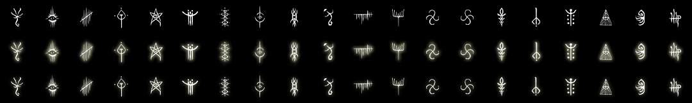

# OPEN-SHELL-source

source of [Open-Shell](https://github.com/Open-Shell/Open-Shell-Menu).

## List

|collect|files|preview|data|
|---|---|---|---|
|[Bloodborne Caryll Runes](bloodborne-caryll-runes)|||[link](bloodborne-caryll-runes/data.md)|

## Todo

- [ ] learn how to make Photoshop scripts
- [ ] make and add other sources